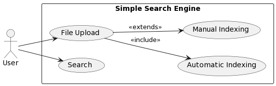
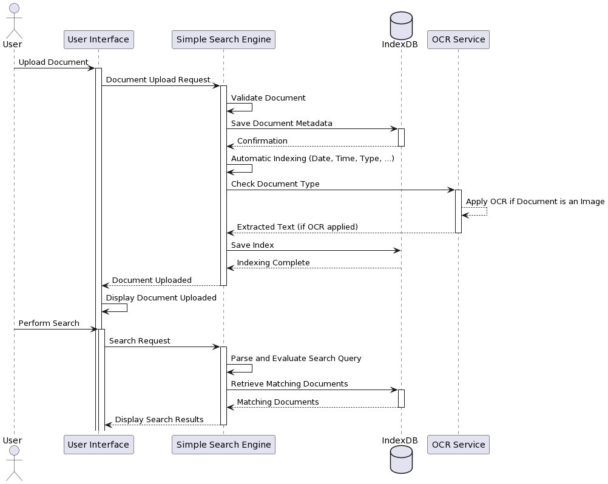

# Simple Search Engine Application

## Group
    - Ismail Charfi
    - Mohamed Hedi Khemiri
    - Naim Dali
    - Youssef Smaoui

## Overview

This Simple Search Engine application allows users to upload documents, index them automatically or manually, and perform efficient searches based on keywords and content.

## Setup

To run the application, follow these steps:

1. Ensure you have docker and nodejs installed.
2. Run `npm install` or `docker-compose up -d`.

## Features

### 1. File Upload

- Upload a file easily through the user interface.

### 2. Indexing

#### a. Automatic Indexing

- The system automatically indexes files by date, time, name, extensions, mime type ...

#### b. Manual Indexing

- Users can manually index files by filling in relevant fields through a provided form. (category, language, keywords)

### 3. Search Engine

- Perform file searches using:
  - boolean expressions (and, or, not, =)
  - key=value

- example:  `content="ismail" or (type="text/plain" and date="2023-12-12")`

### Use Case Diagram

Users can upload files for easy searching in a Simple Search Engine. The system offers automatic indexing during uploads and allows manual indexing as an optional step.

### Sequence Diagram

Users upload documents, which are automatically organized and searchable. The system uses a Simple Search Engine and Index Database, with an optional feature for extracting text from images. Users can easily find and view their documents through a user-friendly interface.

## Demo

https://github.com/IsmailCharfi/search_engine/assets/73357703/486ab52f-a0aa-4937-9494-e857a8600122

